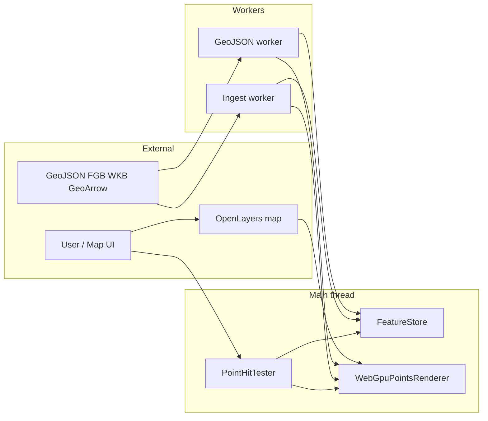

# High-Level Design (HLD)

**Package:** **stratum-map** — GPU-first geospatial **point** rendering for browser maps, designed to align with **OpenLayers** map transforms and canvas conventions without depending on OL at runtime for the core library.

This document states *what* the system is for, *how* major pieces relate, and *what is explicitly out of scope*. API-level detail lives in [USAGE.md](./USAGE.md); module-level detail in [LLD.md](./LLD.md).

---

## 1. Purpose and problem statement

Large geospatial datasets are awkward to drive through classic object-per-feature rendering paths. This library:

- Normalizes geometry into **dense TypedArrays** suitable for GPU upload.
- Parses and flattens data **off the main thread** (Web Workers) where possible.
- Renders with **WebGPU** using a small, fixed **point-sprite** pipeline (instanced quads, disc fragment).
- Supports **GPU picking** (feature id encoded in an offscreen pass) and **CPU-side metadata** (`FeatureStore`) for hit results and extent queries.

It is a **foundation layer**: you wire it to a canvas, feed matrices and buffers, and optionally overlay OL or Canvas2D for labels and chrome.

---

## 2. Stakeholders and consumers

| Consumer | Use |
|----------|-----|
| Application authors | Integrate `WebGpuPointsRenderer`, workers, and `FeatureStore`; map `postrender` / size events (see [USAGE.md](./USAGE.md), demo). |
| Data pipelines | Produce `GeometryBuffer`-compatible buffers + `FeatureRecord[]`; use GeoJSON / FlatGeobuf+WKB / GeoArrow adapters. |
| Future maintainers | Preserve separation: parser ≠ store ≠ renderer; extend render modes only with clear GPU contracts. |

---

## 3. System context

- **OpenLayers** supplies view state and (in examples) the `coordinateToPixelTransform` / extent used to build a **map → clip** matrix for the renderer.
- **Workers** own parsing and chunk assembly; results reach the main thread via **structured clone** with **transferable** `ArrayBuffer`s where applicable.
- **WebGPU** owns draw and pick; the main thread does not re-parse geometry each frame.

---

## 4. Logical architecture (layers)

| Layer | Responsibility | Primary artifacts |
|-------|----------------|-------------------|
| **Types & contracts** | Stable ids, geometry kinds, parser interface | `src/types/*`, `GeometryParser`, `GeometryBuffer` |
| **Core** | Feature metadata, bbox for extent queries | `FeatureStore`, `FeatureRecord` |
| **Parsers** | Format-specific flatten → vertices + ids + styles | `geojson-*`, `geojson-worker`, `ingest-worker` (FGB/WKB) |
| **GeoArrow** | Columnar → same buffer layout as GeoJSON path | `geoarrow-*` |
| **GPU orchestration** | Chunk keys, LRU eviction, pools, incremental draw | `ChunkedGeometryController`, `GpuBufferPool`, `GpuPointChunkSlot`, … |
| **Rendering** | WebGPU device, pipeline, uniforms, chunked or single buffer draw | `WebGpuPointsRenderer`, `POINTS_WGSL` |
| **Picking** | Second pipeline, id render target, readback | `PICK_POINTS_WGSL`, `pickFeatureIdAtCanvasPixel`, `PointHitTester` |

Design intent matches [SYSTEM_OVERVIEW.md](../SYSTEM_OVERVIEW.md) and execution rules in [EXECUTION_GUIDELINES.md](../EXECUTION_GUIDELINES.md).

---

## 5. Data flow (conceptual)

### 5.1 Load path

`Source data` → **Worker** (parse / stream by bbox) → `TransferredGeometryChunk` (positions, featureIds, styleIds, records) → **Main** → GPU buffers via `WebGpuPointsRenderer.setGeometry` / `ingestTransferredWorkerChunk` → optional `FeatureStore.ingestRecords*`.

### 5.2 Frame path

Map frame state → **4×4 map→clip matrix** (column-major, OL-style) → `WebGpuPointsRenderer.setMapToClipMatrix` → `render({ timeMs })` → swapchain / canvas.

### 5.3 Pick path

Canvas pixel (backing store coords) → GPU pick pass → RGBA8 id decode → `FeatureStore.getById` → feature metadata.

---

## 6. What is built today (capability summary)

| Area | Status |
|------|--------|
| Point sprites (circles) in WebGPU | Shipped |
| Style table (color, size), per-vertex `styleId` | Shipped |
| Single buffer or **keyed GPU chunks** + LRU eviction | Shipped |
| GeoJSON worker + client | Shipped |
| Ingest worker: **FlatGeobuf bbox** + **WKB** path | Shipped (see worker) |
| GeoArrow flatten helpers | Shipped (adapter layer) |
| GPU picking + `PointHitTester` | Shipped |
| `ChunkedGeometryController` | Shipped (orchestration) |
| Lines/polygons as **stroked/filled** vector GPU primitives | **Not** shipped — vertices exist but draw is still points |
| Text / labels in WebGPU | **Not** shipped — demos may use Canvas2D overlay |
| OL as a hard dependency inside `src/` | **No** — OL is devDependency for examples only |

Roadmap-style phasing is described in [PHASES.md](../PHASES.md) (not all phases imply complete features in tree).

---

## 7. Non-functional requirements

- **Main thread stays responsive:** parsing in workers; avoid large synchronous CPU loops during pan/zoom.
- **Memory:** chunked GPU paths and optional buffer pools; eviction hooks to align CPU indexes with GPU.
- **Portability:** WebGPU + Chromium-class browsers for demos; secure context for workers/GPU.
- **Node ≥ 20** for tooling (see `package.json`).

---

## 8. Related documents

| Document | Role |
|----------|------|
| [LLD.md](./LLD.md) | Modules, buffers, shaders, sequences |
| [USAGE.md](./USAGE.md) | Install, exports, APIs, examples |
| [SYSTEM_OVERVIEW.md](../SYSTEM_OVERVIEW.md) | Short architecture summary |
| [EXECUTION_GUIDELINES.md](../EXECUTION_GUIDELINES.md) | Engineering constraints |
| [PHASES.md](../PHASES.md) | Planned execution order |

---

## 9. Repository map (applications vs library)

| Path | Role |
|------|------|
| `src/` | Library implementation and `package.json` exports |
| `examples/demo/` | Large point demo + OL + optional Canvas2D labels |
| `examples/pan-zoom-bench/` | Bench / worker integration harness |
| `tests/` | Playwright + Node tests |
