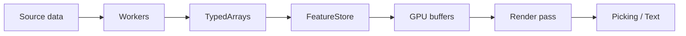
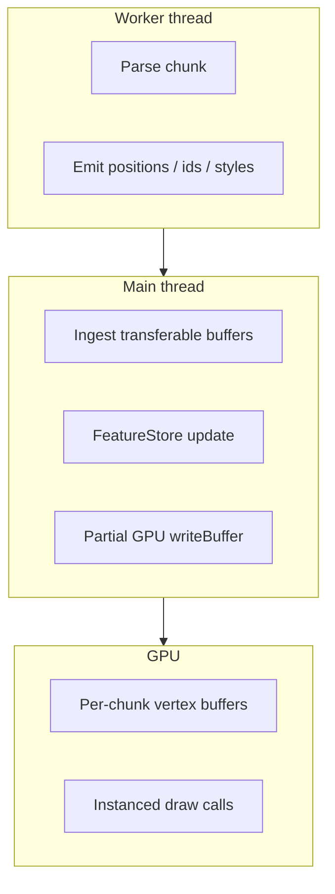

# Architecture

## Data path

## Layers

| Layer | Responsibility |
|-------|------------------|
| **Workers** | Parse GeoJSON / ingest payloads; emit chunked `ArrayBuffer` views |
| **FeatureStore** | Feature id ↔ metadata, bbox queries, upsert/remove |
| **GpuPointChunkSlot** | Per-chunk vertex buffers + LRU participation |
| **WebGpuPointsRenderer** | Pipelines, uniforms, draw encoding, optional pick target |
| **TextLayer / TextRenderer** | CPU layout + MSDF/bitmap atlas + text draw pass |

## Chunked geometry

## Design rules

- The **renderer does not parse file formats** — only dense buffers and uniforms.
- **TypedArrays** are the contract across thread boundaries; prefer `Transferable` ownership moves.
- **Picking** and **text** are optional subsystems with their own resources but share the same canvas pixel space.
